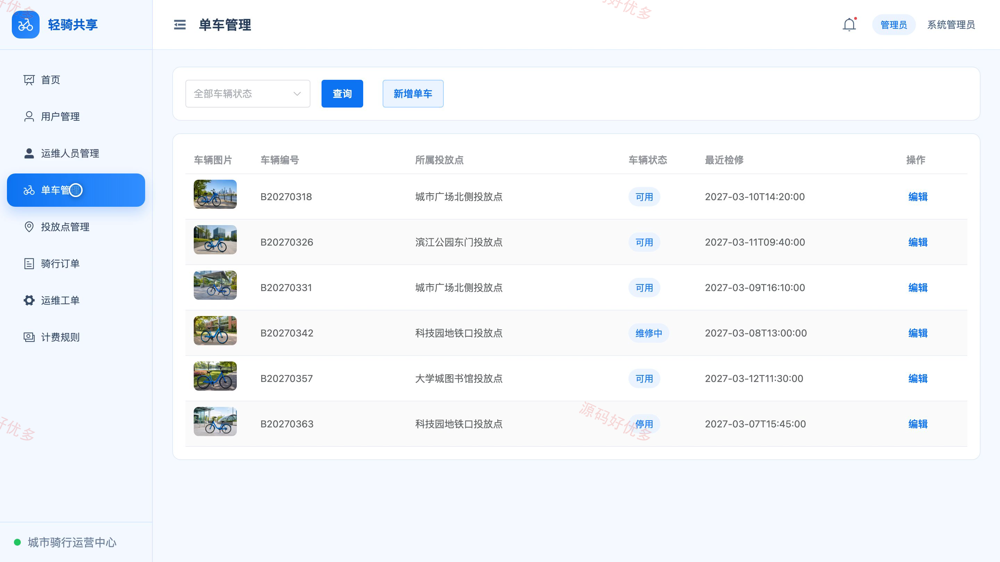
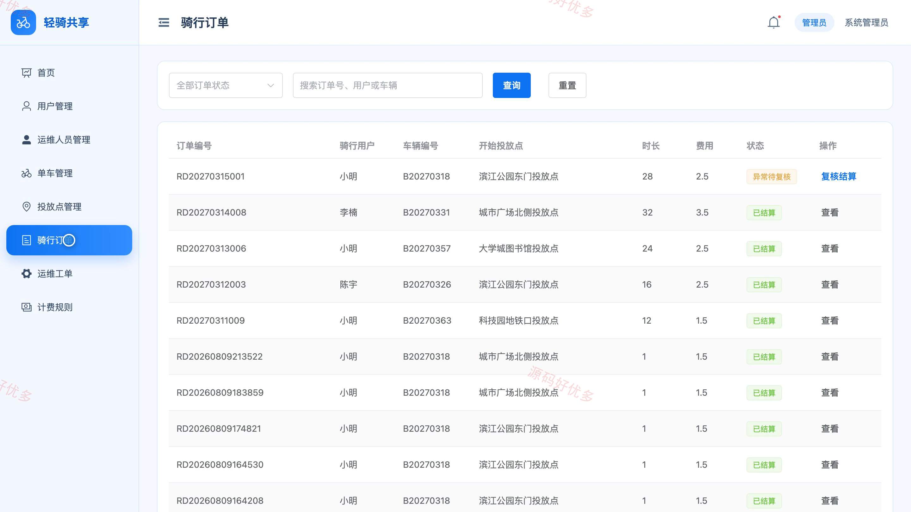

# bs023A
bs023A共享单车管理系统
## 源码问题查看主页咨询

### 一、关键词
共享单车、城市骑行、单车租赁、绿色出行、智慧调度

### 二、作品包含
源码+数据库+全套环境和工具资源+本地部署教程

### 三、项目技术
前端技术： Html、Css、Js、Vue3.4、Element-Plus
后端技术：Java、SpringBoot3.2.0、MyBatis-Plus

### 四、运行环境（以下版本亲测，其他版本兼容性请自行测试）
开发工具：IDEA/eclipse + VSCODE

数据库：MySQL5.7+（共14张表）

数据库管理工具：Navicat10以上版本

环境配置软件： JDK17 + Maven3.6.3

前端Nodejs：16+

浏览器：谷歌浏览器

### 五、项目介绍
项目编号：bs023A

共享单车管理系统面向骑行用户、运维人员和管理员，围绕车辆投放、骑行计费、还车结算、故障上报、运维调度与运营统计形成完整业务闭环，实现共享单车全流程协同管理。

角色：骑行用户、运维人员、管理员

骑行用户功能：账号登录与个人中心、车辆与投放点查询、开始用车、骑行计费、还车结算、骑行记录、故障上报、账户充值。

运维人员功能：运维工作台、待办任务、单车与投放点管理、车辆调度、故障检修、投放点巡检、车辆状态维护、运维记录。

管理员功能：运营数据看板、骑行用户管理、运维人员管理、单车管理、投放点管理、骑行订单管理、运维工单管理、计费规则管理。

### 六、运行截图

